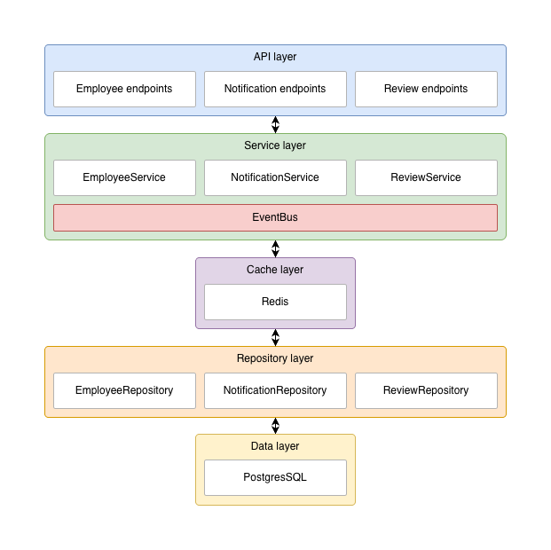

# Architecture

The system is split into 5 layers:

- `API`: See [api module](../api) and [routes](../api/src/main/kotlin/org/jetbrains/hris/api/routes)
- `Services`: [service-employee](../service-employee), [service-notification](../service-notification),
  [service-review](../service-review).
  With [EventBus](../infrastructure/src/main/kotlin/org/jetbrains/hris/infrastructure/events/EventBus.kt) for certain
  use cases.
- `Cache`: With [RedisCache](../infrastructure/src/main/kotlin/org/jetbrains/hris/infrastructure/cache/RedisCache.kt)
- `Repositories`: Each service module contains its own repository class for database access (e.g., `EmployeeRepository`,
  `ReviewRepository`)
- `Data layer`: [database](../database) with [schemas](../database/src/main/kotlin/db/schemas)

## Application

[Application](../application) module serves as the entry point that defines and configures:

1. Database connection and initialization
2. Plugin
   installation [plugins](../application/src/main/kotlin/org/jetbrains/hris/application/config/installPlugins.kt):
   `ContentNegotiation`, `RequestValidation` and `StatusPages` with error handling
3. Metrics plugin and endpoint configuration
4. Routes and services initialization via DI container
5. [Notification service](notifications.md) startup
6. Route registration